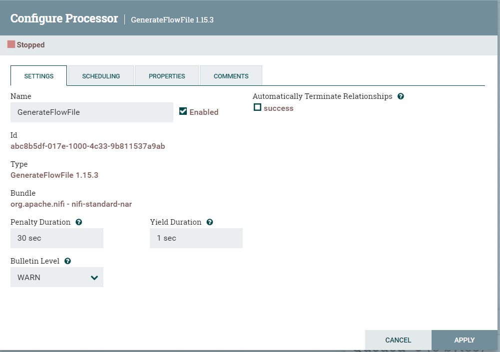
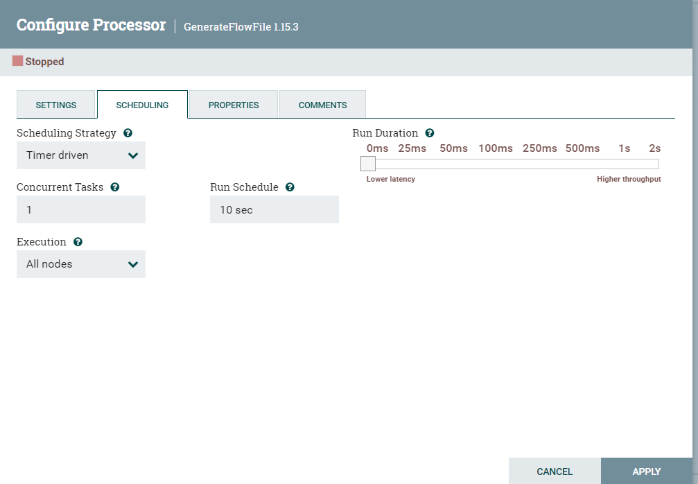

# Some common properties among all the processors.
- [Some common properties among all the processors.](#some-common-properties-among-all-the-processors)
  - [Setting Tab:](#setting-tab)
  - [Scheduling Tab](#scheduling-tab)
  - [Properties Tab](#properties-tab)
  - [Comments Tab](#comments-tab)

To configure a processor, right-click on the Processor and select the Configure option from the context menu. Alternatively, just double-click on the Processor. we can see below screen once we do that. Apart from the options in properties tab other all tabs are common in all processor.

## Setting Tab: 

In setting tab, we can change the name of the processor. we are able to make it enable and disable. When we add processor to canvas it is enable by default. If we diable the processor then it cannot be started. Next configurable component in setting tabs are 
- Penalty Duration  
Penalty duration refers to the wait of the processor to process certain file after any event occurs. After the pernalty duration is over the file will be processed again.
- Yield Duration  
Yield duration refers to the period of time in which scheduled of processor cannot be run due to some error in the processors.
- Bulletin Level  
Bulletin level provide the lowest level of logging that should be provided to the user interface.

And the next setion in setting tab is "Automatically Terminate Relationship". Each of the relationship that is defined by the processor is listed here.  If we checked at this section, any flow file that is routed to that relationship will be removed from the flow and it's processing is considered complete.

[for more on setting tab](https://nifi.apache.org/docs/nifi-docs/html/user-guide.html#settings-tab)

## Scheduling Tab

the first options in scheduling tab 
- Scheduling Strategy  
There are 3 possible options for scheduling 
    - Timer driven:  
     This is default mode. The processor will be scheduled to run on regular interval. The interval at which processor is run is defined by the "run Schedule" option
    - Event Driven: "Experimental "
    - CRON driven: similar to time driven but cron parameter are given to "run Schedule".
- Concurrent Task:  
This options defines how many flowfiles should be processed by the processor at the same time.
- Run Schedule:  
This option defines how often the processor should be scheduled to run. the valid value of this feild depends on the "Scheduling Strategy".
-Execution:  
This option define on which nodes the processor will be scheduled to execute.
- Run Duration  
This options defines how long te processor should be scheduled to run each time that is triggered. 

[for more on scheduling tab](https://nifi.apache.org/docs/nifi-docs/html/user-guide.html#scheduling-tab)

## Properties Tab
This tab is used to configure processor specific behaviour. 

## Comments Tab
This is options tab to add comment.
