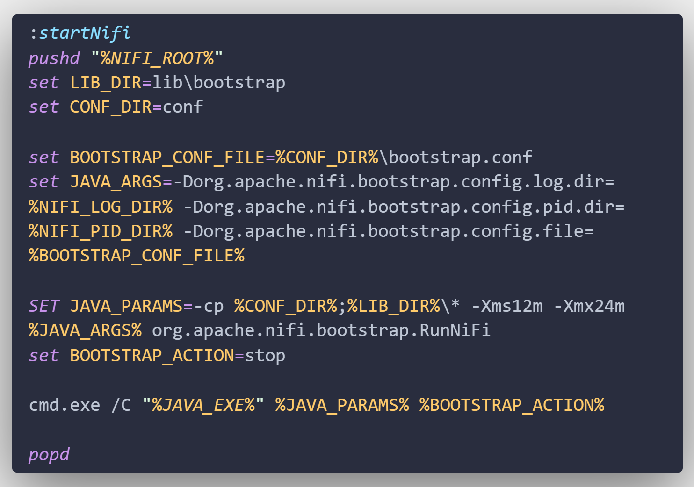

# 1. Nifi: Notes: 

## 1.1. installation process 

- download the binary file from official [Nifi website](https://nifi.apache.org/download.html)
- unzip the downloaded compressed file.
- Every command that are required to run, see status, and stop will be in ``/bin``. To start the Nifi for windows we will use ``run-nifi.bat`` file. And we dont have any particular file to stop the Nifi conosle but we can create the stop file using the ``run-nifi.bat`` file. Only change the command as you see below.
  
- After running the ``run-nif.bat`` file all the logs generated will be kept on the file ``/logs/nifi-app.logs``. we need to check this file for the URL and port on which nifi is running an also the auto generated **username** and **password**. There is a command to generate user and password. 
- And now we can use Nifi.

## 1.2. common Terminologies

- Flow Based Programming: 
Nifi is based on flow based programming(FBP). Flow Based Programming(FBP) is a programming paradigm that defines applications as networkds of "black box" processes, which exchange data across predefined connections by message passing where the connections are specified externally to the processes. These black box proecesses can be reconnected endlessly to form different application without having to be changed internally. FBP is thus naturally commponent-oreinted.

- How Nifi works? Nifi consists of atomic elemnents which can be combined to groups to build a data flow. Nifi consists of processors and process Groups.

- Processors are an atomic elements in Nifi which can do some simple tasks. Each processors in Nifi is unique in it's own ways. We can ave data source and data sink processors. the source and sink can be anything - sql, nosql, search enigne, cache server, messaging queue, etc. Nifi supports custom processors as well. 

- **FlowFile** is the actual data on which data flow. It is abstraction of data in Nifi. A processor can generate new flow file by processing an existing flow file or ingesting new data from any source. As we already know flow file contains the actual data. flow file is composed of 2 components *content* and *attributes*. 
    - Context is the actual context or data of the flow file. it's the actual content of a file you would read using GetFile, GetHttp, etc processors
    - Attributes are the metadata from the flowfile. these file contains information about te content like when was the file created, it's name, where is it from, and what does it represent. <br>
**Life cycle of flow file:**
      - flow files are presisted in the disk. 
      - flow files are passed by reference
      - a new flow file will be created if the content of the existing flow file is modified or new data is ingested from sources.
      - New flow file will not be created if the attributes of the existing flow file is modified.


- Connection: In Nifi all processors can be connected with each other to create data processing flow. Processors are linked via connections.  Each connection will acts as a Queue for flowfiles.

- Process Group: they are the sets of processors. process group helps to maintain large and complex data flow. Inputs and output parts are used to move data between process Groups.

- Controller Services: A controller services is a shared service that can be used by a processor. Controller service can hold DB connection details. We can create Controller Servic from CSV reader, json Writer and many more.


```console
Generated Username [eea174a9-4469-4fbb-a102-98d56b39ff88]
Generated Password [pM3Aa/6ZRZpqp8mtcvssO/M6PHzlDFbt]
```


- Relationship : each processor has zero or more relationship defined for it. Relationship are named to indicate the result of processing a flowfile. After a processor has finished processing a flowfile, it will transfer the flowfile to one of the relationships. The flow file creator needs to handle all the relationship of a processor or terminate unhandled relationship. 

# Other Sections 

## [Common properties](commonproperties.md)